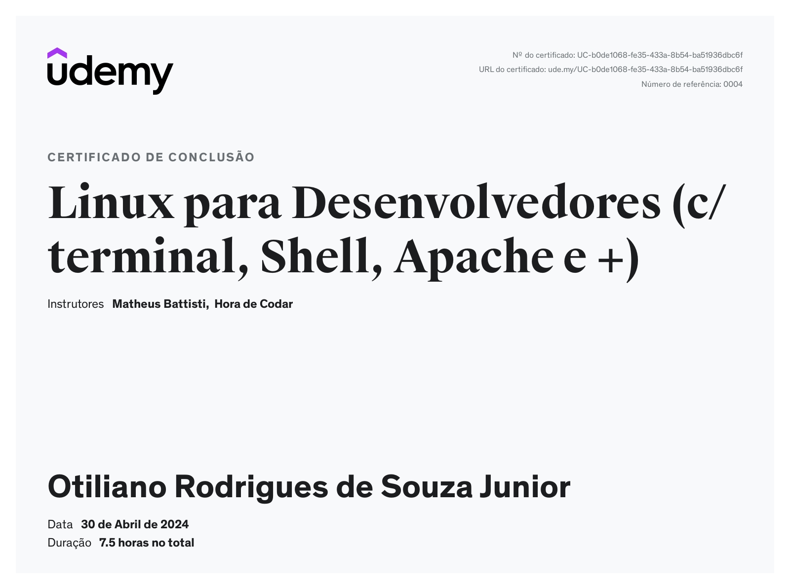

## Sprint 1: Nivelamento de Conhecimento (Markdown Aprimorado)

### Objetivo

O objetivo principal da Sprint 1 foi promover o nivelamento do conhecimento da equipe em ferramentas e metodologias essenciais para o desenvolvimento do projeto.

### Primeira Etapa: Familiarização com Ferramentas Básicas

**1. Domínio do Git e Markdown:**

* Aprofundamento no uso do Git para inicialização e gerenciamento do repositório do projeto.
* Criação e aprimoramento do arquivo README.md utilizando Markdown para documentar as etapas do projeto de forma clara e concisa.

**2. Apresentação Pessoal e Curriculo:**

* Elaboração de uma apresentação individual para introduzir-se aos stakeholders e destacar habilidades relevantes.
* Construção de um currículo atualizado e personalizado, evidenciando experiências e qualificações para o projeto.

**3. Estruturação do Projeto:**

* Adoção de um template pré-definido para organizar o projeto em sprints, facilitando a navegação e acompanhamento do progresso.

### Segunda Etapa: Dominando Habilidades em Linux e Markdown

**1. Desafio Prático com Comandos Linux e Markdown:**

* **Download do Arquivo:** Baixar o arquivo `dados_de_vendas.csv` para iniciar o desafio prático.
* **Criação da Estrutura de Diretórios:**
    * Criar um diretório principal chamado `ecommerce` no sistema Linux.
    * Dentro do diretório `ecommerce`, inserir o arquivo `dados_de_vendas.csv`.

**2. Desenvolvimento do Script `processamento_de_vendas.sh`:**

* Criar um script executável nomeado `processamento_de_vendas.sh` para automatizar as tarefas do desafio.
* O script deve utilizar comandos Linux para executar as seguintes ações:
    1. Criar um diretório chamado `vendas`.
    2. Dentro do diretório `vendas`, criar um subdiretório chamado `backup`.
    3. Copiar o arquivo `dados_de_vendas.csv` para o diretório `backup`.
    4. Renomear o arquivo copiado no diretório `vendas` no formato `dados-yyyymmdd.csv`, utilizando a data atual.
    5. Dentro do diretório `backup`, renomear o arquivo para `backup-dados-<yyyymmdd>.csv`.

**3. Geração de Relatórios:**

* Criar um arquivo `relatorio.txt` dentro do diretório `backup`.
* O conteúdo do `relatorio.txt` deve incluir:
    1. Data e hora do sistema operacional no formato `yyyy/mm/dd HH:mm`.
    2. Primeiro registro contido no arquivo `backup-dados-<yyyymmdd>.csv`.
    3. Data do último registro contido no arquivo `backup-dados-<yyyymmdd>.csv`.
    4. Quantidade total de itens diferentes vendidos.
    5. Os 10 primeiros registros do arquivo `backup-dados-<yyyymmdd>.csv`.

**4. Limpeza e Compactação:**

* Compactar o arquivo `backup-dados-<yyyymmdd>.csv` utilizando o comando `zip` e alterar seu nome para `backup-dados-yyyymmdd.zip`.
* Remover o arquivo original `backup-dados-<yyyymmdd>.csv` da pasta backup e o arquivo `dados_de_vendas.csv` da pasta `vendas`.

**5. Agendamento Automático:**

* Criar uma rotina utilizando o cron para executar o script `processamento_de_vendas.sh` automaticamente de segunda a quinta-feira às 15:27.

**6. Geração de Relatórios Consolidados:**

* Modificar o conteúdo do arquivo `dados_de_vendas.csv` uma vez por dia para gerar diferentes relatórios.
* Criar um novo script executável chamado `consolidador_de_processamento_de_vendas.sh` para unir os relatórios gerados em um único arquivo.
* Executar o script `consolidador_de_processamento_de_vendas.sh` manualmente para gerar o relatório final consolidado.

### Observações

* Os scripts de execução (`processamento_de_vendas.sh` e `consolidador_de_processamento_de_vendas.sh`) e arquivos gerados podem ser encontrados na pasta `etapa-2`.
* Os demais arquivos e imagens relacionados ao desafio estão na pasta `assets` dentro do diretório `desafio`.

### Certificados

