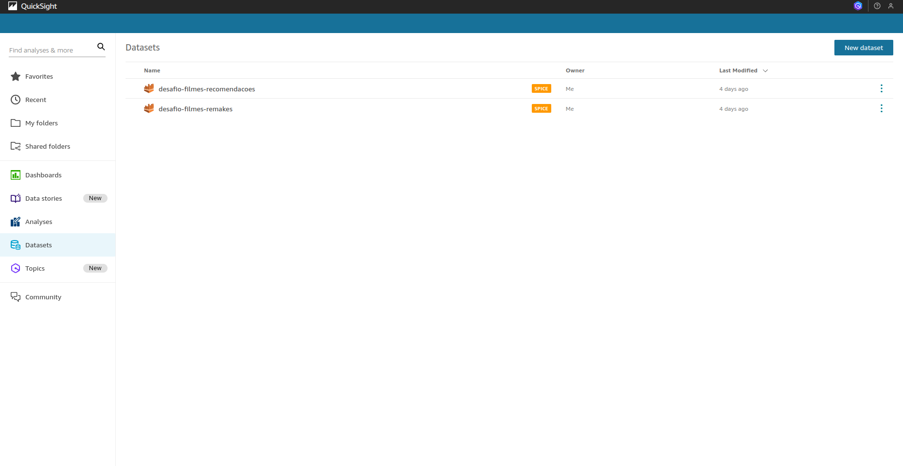
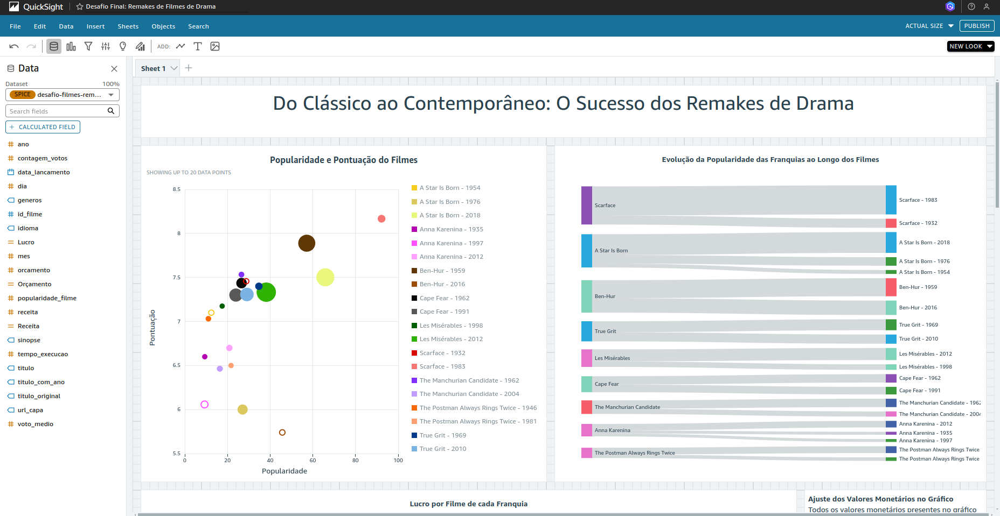
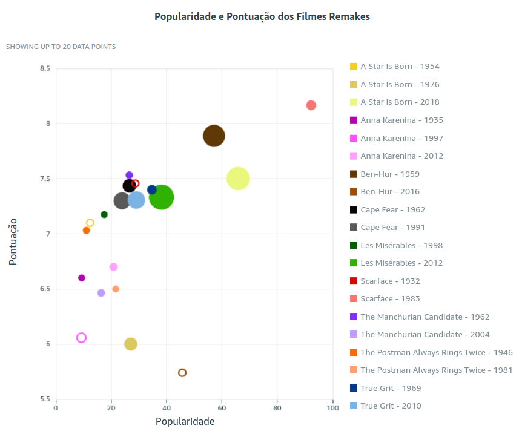
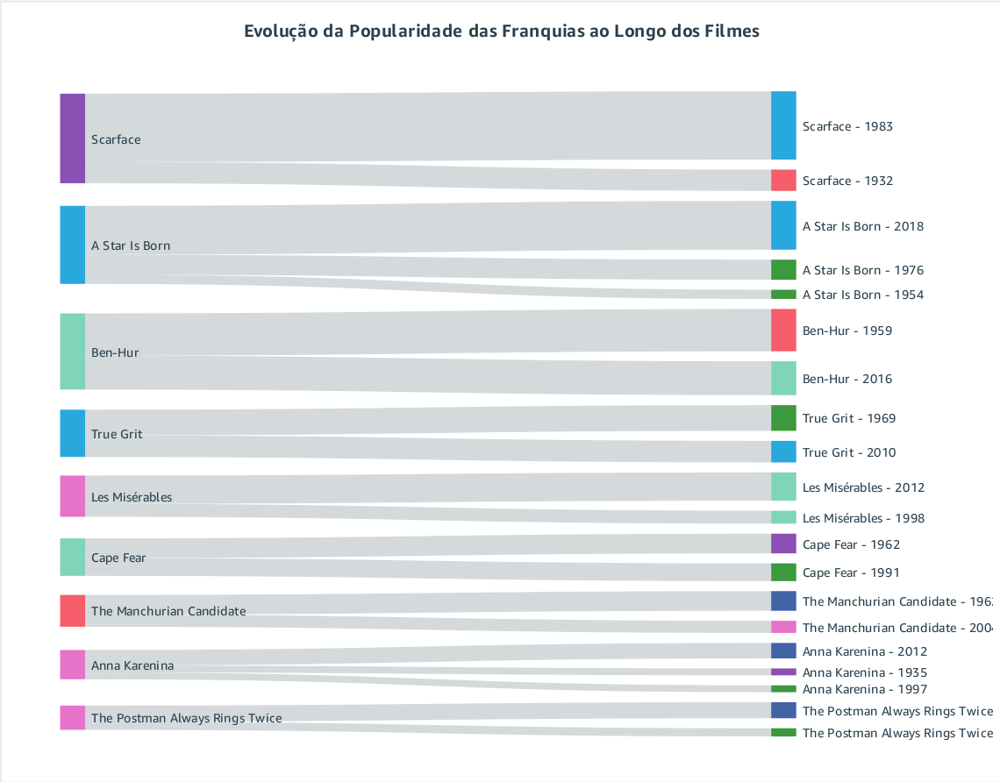
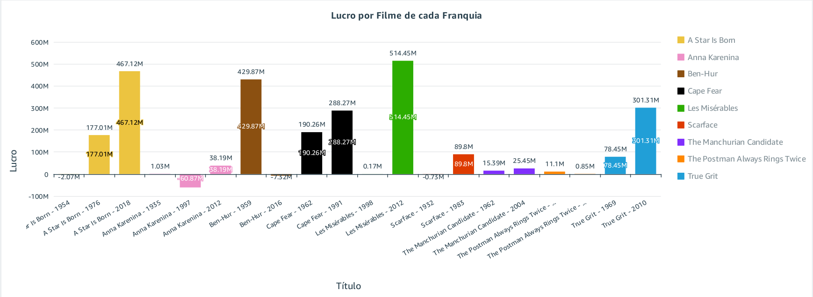
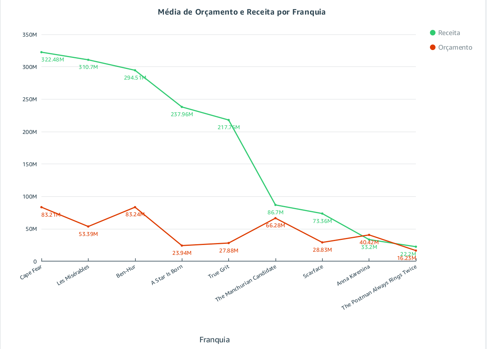
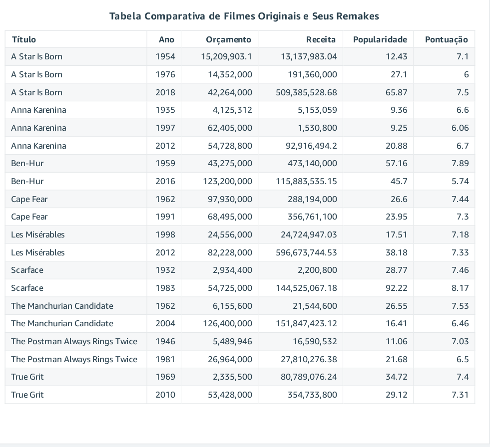
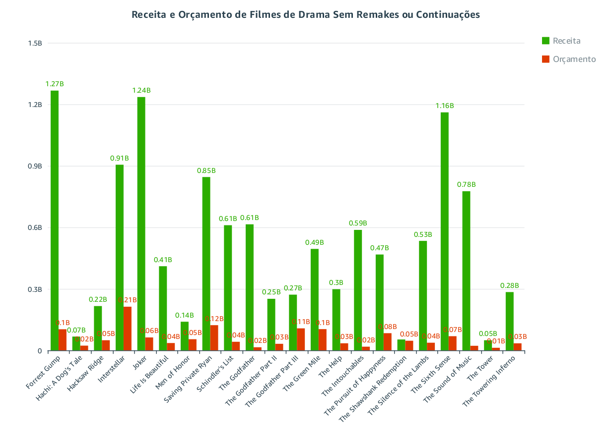
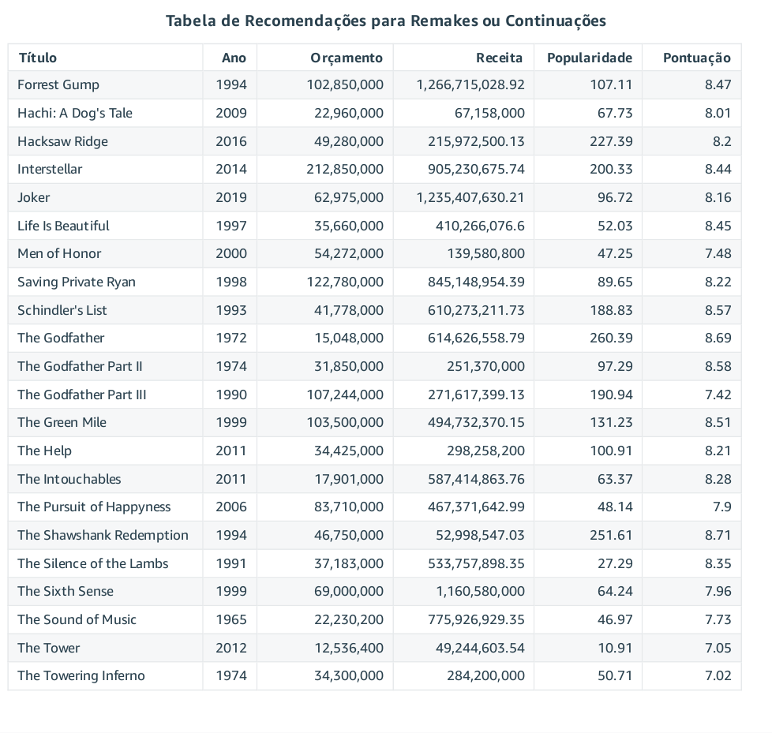

## Sprint 10: Desafio Final

### Objetivo

Desenvolver a camada de consumo do Data Lake, incluindo a criação de um dashboard que responda às questões selecionadas.

## Desafio da Sprint

Para que os dados do Data Lake sejam efetivamente aproveitados, é fundamental transformá-los em informação e conhecimento úteis para a tomada de decisões. A análise e visualização de dados são essenciais para alcançar esse objetivo, fornecendo insights que fundamentam o sucesso do projeto.

### ➡️ Primeira Etapa

Utilize o banco de dados dimensional criado na sprint anterior para gerar os datasets que serão analisados nesta sprint.

- 

Empregue o script [Filtro de Filmes Remakes](evidencias/scripts/query-filtro-filmes-remakes.sql) para obter o dataset dos filmes remakes e o script [Filtro de Filmes Recomendações](evidencias/scripts/query-filtro-filmes-recomendacoes.sql) para obter o dataset dos filmes recomendados. Esses datasets servirão como base para a criação do dashboard.

- 

Utilize a ferramenta de análise para explorar os dados dos datasets, construindo gráficos e tabelas que respondam às perguntas levantadas para este desafio. Crie o dashboard "Desafio Final: Filmes de Drama Remake".

- 

### ➡️ Análise do Dashboard

O dashboard completo em PDF pode ser acessado [aqui](desafio/dashboard_desafio_final.pdf). A seguir, uma análise detalhada de cada gráfico e tabela:

### Do Clássico ao Contemporâneo: O Sucesso dos Remakes de Drama

- **Gráfico: Popularidade e Pontuação dos Filmes Remake**  
  Este gráfico ilustra a popularidade e a pontuação de cada filme pelo público. Observa-se que todos os filmes têm uma pontuação alta, acima de 5,5, indicando que são bem avaliados pela crítica. A popularidade, ligada a fatores como menções em redes sociais e quantidade de votos, revela que, apesar de não serem recentes, esses filmes ainda são relevantes. A grandeza das bolhas representa o lucro, e a maioria desses filmes gerou lucro. As cores foram escolhidas com base nas capas dos filmes.

  - 

- **Gráfico: Evolução da Popularidade das Franquias ao Longo dos Filmes**  
  Este gráfico mostra que os primeiros filmes de cada franquia estabelecem a base, mas a popularidade é frequentemente impulsionada pelos lançamentos mais recentes.

  - 

- **Gráfico: Lucro por Filme de Cada Franquia**  
  Este gráfico revela que, na maioria dos casos, os remakes geram lucro superior ao dos filmes originais. As cores foram atribuídas por franquia para manter a identidade de cada grupo.

  - 

- **Gráfico: Média de Orçamento e Receita por Franquia**  
  Mostra que, em quase todas as franquias analisadas, o orçamento total justifica a continuidade ou o remake dos filmes, com médias de receita e orçamento bastante favoráveis. As cores representam receita (verde) e orçamento (vermelho) para refletir a relação entre entrada e saída de dinheiro.

  - 

- **Tabela: Comparativa de Filmes Originais e Seus Remakes**  
  Apresenta uma visão geral dos dados utilizados nos gráficos, detalhando filmes e seus remakes.

  - 

### Recomendação de Filmes de Drama de Sucesso Sem Remakes ou Continuações

- **Gráfico: Receita e Orçamento de Filmes de Drama Sem Remakes ou Continuações**  
  Este gráfico demonstra que diversos filmes desta categoria geraram grandes receitas com orçamentos relativamente baixos, apontando boas oportunidades para futuros remakes ou continuações.

  - 

- **Tabela: Recomendações para Remakes ou Continuações**  
  Exibe os dados completos dos filmes utilizados para recomendações, facilitando a análise para selecionar quais filmes considerar para continuação ou remake. As cores representam receita (verde) e orçamento (vermelho) para manter a relação entre entrada e saída de dinheiro.

  - 

### ➡️ Resolução do Desafio

**Análise de Remakes e Continuações de Filmes Clássicos de Drama**

Os remakes de filmes clássicos são uma tendência contínua na indústria cinematográfica. Esta análise revela como filmes clássicos de drama podem se beneficiar enormemente de remakes e continuações. A avaliação de aspectos como orçamento, bilheteira e recepção crítica mostra que os remakes frequentemente mantêm ou superam o sucesso dos originais, identificando os elementos-chave que contribuem para seu êxito e destacando o potencial para futuros projetos.

A modernização e reinterpretação de histórias clássicas têm um impacto positivo significativo no desempenho comercial e crítico dos filmes. Investir em remakes e continuações de filmes de sucesso no gênero drama não só preserva e atualiza histórias amadas, mas também permite explorar novas abordagens que cativam o público contemporâneo, revelando novas perspectivas sobre o que torna uma história verdadeiramente atemporal.

### Evidências

- **Arquivos Adicionais:**  
  As imagens relacionadas ao desafio estão organizadas na pasta [evidencias/fotos](evidencias/fotos) e os arquivos de script na pasta [evidencias/scripts](evidencias/scripts).

### ➡️ Resolução de Exercícios

**Exercícios Resolvidos:**  
Não houve exercícios nesta sprint.

### Certificados 🎓

**Certificados:**  
* [Curso AWS - Introdução Completa ao Amazon QuickSight](certificados/certificados-aws-quicksight.jpg) ✅

---