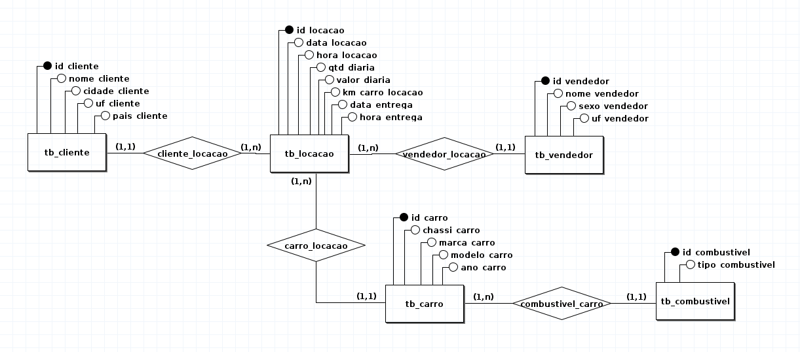
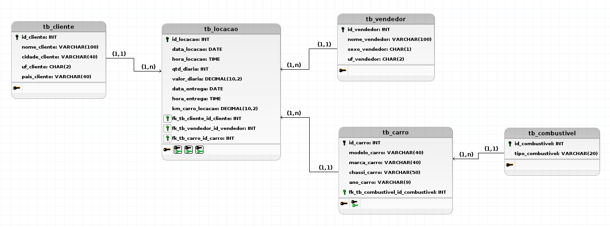
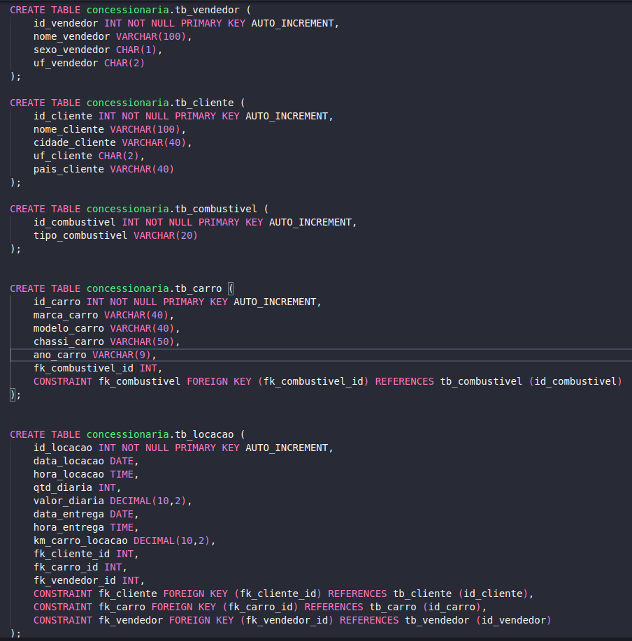
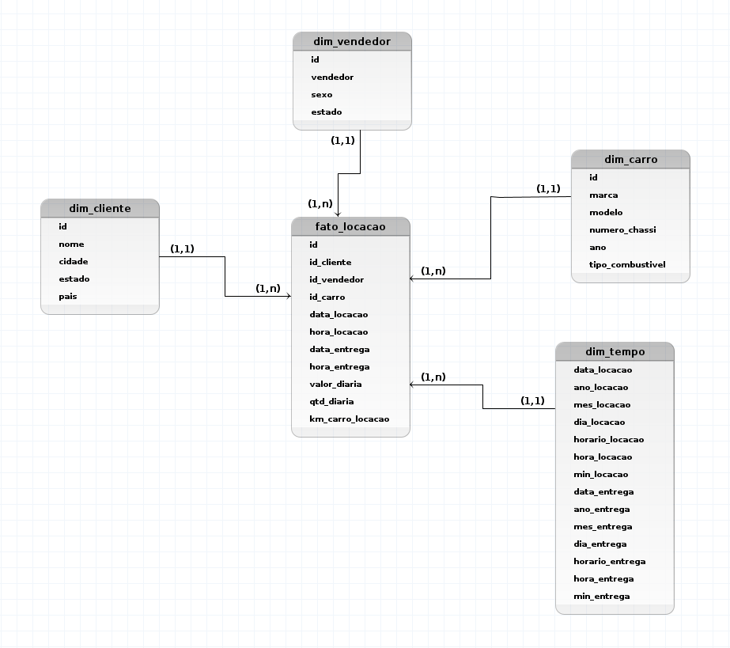

## Desafio Etapa 1:

**Normalização:**

O banco concessionaria.sqlite foi normalizado um processo crucial para organizar e estruturar as informações armazenadas de maneira eficiente e confiável. Através da normalização, minimizamos redundâncias, eliminamos anomalias e garantimos a integridade dos dados.
 
 * 1FN - Nessa etapa retiramos os atributos e grupos repetidos;
 * 2FN - Separamos as dependências Parciais;
 * 3FN - Eliminamos as dependências transitivas
 * Além da normalização para chegarmos ao modelo relacional do banco, também construimos os modelos conceitual e lógico utilizando a ferramenta
 brModelo.

**Modelo Conceitual:**

* O arquivo do brModelo pode ser encontrado aqui:  `concessionaria_conceitual.brM3`: [concessionaria_conceitual.brM3](../evidencias/concessionaria_conceitual.brM3)

**Modelo Lógico:**

* O arquivo do brModelo pode ser encontrado aqui:  `concessionaria_logico.brM3`: [concessionaria_logico.brM3](../evidencias/concessionaria_logico.brM3)

**Modelo Físico: Modelagem Relacional**

* O banco concessionaria normalizado pode ser encontrado aqui:  `concessionaria_fisico.sql`: [concessionaria_fisico.sql](../desafio/etapa-1/concessionaria_fisico.sql)

* Além da construção fizemos a migração do banco concessionaria.sqlite para sql [migracao-sql](/sptint-2/evidencias/migracao_sqlite_sql.csv);

* Após a migração, fizemos o insert no banco normalizado com todos os dados da migração [insert-banco-relacional-sql](/sptint-2/evidencias/concessionaria_insert_migracao.sql);

* Por fim fizemos uma consulta para mostrar todo conteúdo do banco relacional [consulta-banco-relacional-sql](/sptint-2/evidencias/consulta_modelo_relacional.sql);

## Desafio Etapa 2:

**Modelo Dimensional:**

A mudança do modelo relacional para o modelo dimensional representa uma transição crucial no paradigma de armazenamento e análise de dados. Enquanto o modelo relacional se destaca na organização e transacionalidade dos dados, o modelo dimensional se especializa na análise e visualização.

* Criação da VIEW fatos_locacao;
* Criação da VIEW dim_clientes;
* Criação da VIEW dim_vendedor;
* Criação da VIEW dim_carro;
* Criação da VIEW dim_tempo;

O arquivo de sql do modelo conceitual pode ser encontrado aqui: [concessionaria_dimensional.sql](../desafio/etapa-2/concessionaria_dimensional.sql), e o modelo explicativo do relacionamento pode ser visto a seguir.

**Conclusão:**

O modelo relacional é ideal para armazenar e gerenciar grandes volumes de dados de forma eficiente, enquanto o modelo dimensional se destaca na análise complexa, visualização e suporte à tomada de decisão. A escolha entre os modelos depende das necessidades específicas da organização e dos objetivos de uso dos dados.

