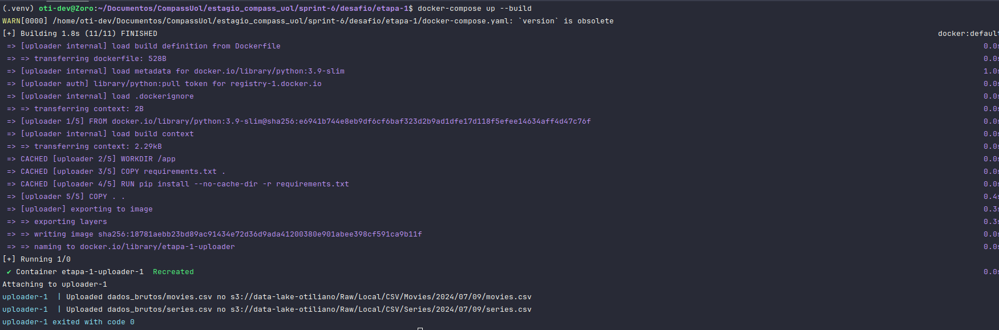
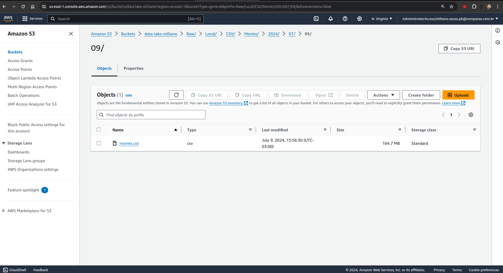
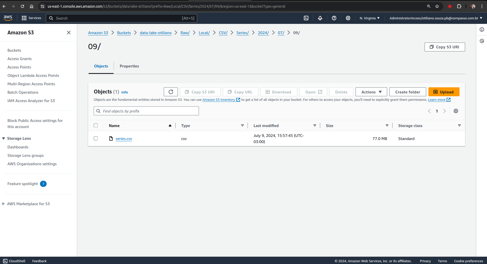

### Desafio Etapa 1

Para esta etapa, é necessário utilizar o Docker-Compose. Ele será responsável pelo volume com os dados [movies.csv](../desafio/etapa-1/dados_brutos/movies.csv) e [series.csv](../desafio/etapa-1/dados_brutos/series.csv) 
que serão feitos upload, assim como o funcionamento do script [data_loader.py](../desafio/etapa-1/data_loader.py).

1. Primeiro, navegue até o diretório `sprint-6/desafio/etapa-1`:

   ```bash
   cd sprint-6/desafio/etapa-1
   ```

2. Crie um arquivo `.env` com suas credenciais:
   - Para isso, faça uma cópia do [.env.example](../desafio/etapa-1/.env.example) e substitua os locais indicados pelas suas credenciais.


3. Em seguida, execute o Docker Compose:

   ```bash
   docker-compose up --build
   ```

Assim que o código finalizar a execução, você verá esses logs de execução:

- Imagem do container em execução: 

Os arquivos no bucket terão a seguinte estrutura, origem/tipo/nome/ano/mês/dia/arquivo, assim teremos registro do dia da execução:

- `data-lake-otiliano/Raw/Local/CSV/Movies/2024/07/09/movies.csv`
  - Imagem: 

- `data-lake-otiliano/Raw/Local/CSV/Series/2024/07/09/series.csv`
  - Imagem: 

### Notas do Desafio

- É necessário possuir uma conta na AWS.
- Ter criado um bucket S3 para o armazenamento dos dados coletados.

### Conclusão sobre o desafio.

A AWS, com serviços como Amazon S3, Glue, Athena e Lake Formation, oferece uma infraestrutura robusta para data lakes, 
permitindo a coleta, armazenamento e análise de dados de forma eficiente e econômica. 
Este é o primeiro passo para a construção do desafio, portanto, é crucial que não haja erros para que as próximas etapas sejam 
onstruídas de forma eficiente.