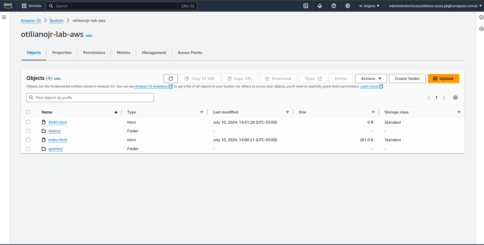
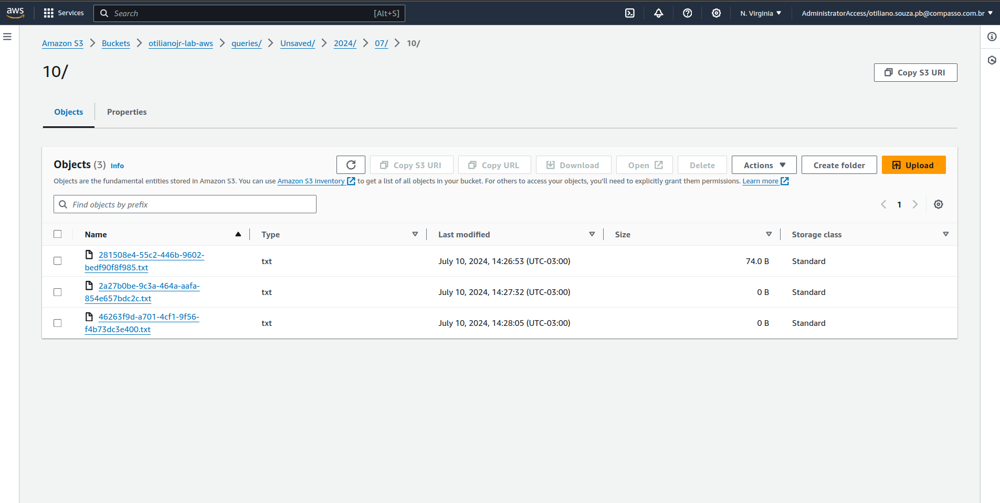
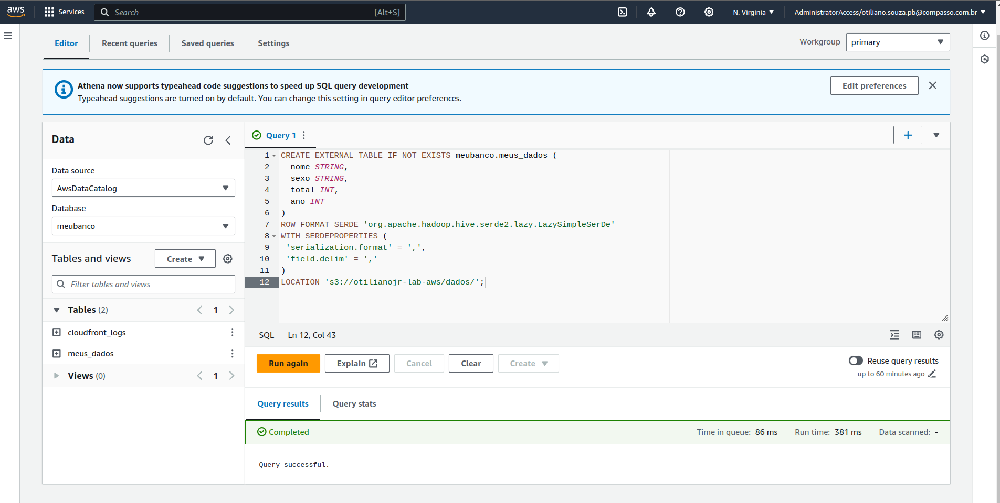
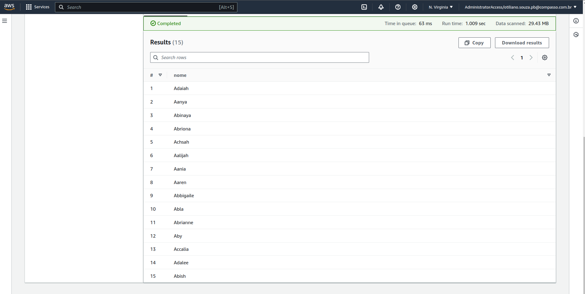
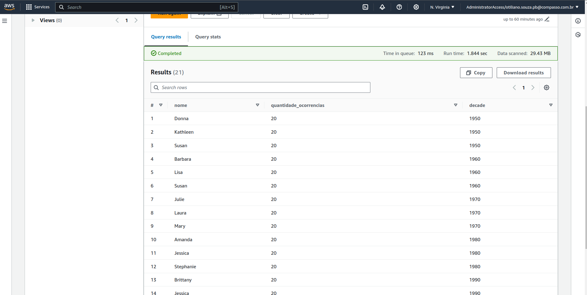

# Lab AWS Athena

## Pré-requisitos
- Certifique-se de ter concluído o [Lab AWS S3](../lab-aws-s3).

## 1. Estruturar o Bucket
- Imagem: 

## 2. Criar um Banco de Dados

```sql
CREATE DATABASE meubanco;
```

## 3. Criar uma tabela para logs do CloudFront

```sql
CREATE EXTERNAL TABLE IF NOT EXISTS meubanco.cloudfront_logs (
  `Date` DATE,
  Time STRING,
  Location STRING,
  Bytes INT,
  RequestIP STRING,
  Method STRING,
  Host STRING,
  Uri STRING,
  Status INT,
  Referrer STRING,
  ClientInfo STRING
) 
ROW FORMAT DELIMITED
FIELDS TERMINATED BY '\t'
LINES TERMINATED BY '\n'
LOCATION 's3://athena-examples-us-east-1/cloudfront/plaintext/';
```
- Imagem:  

## 4. Criar Tabela para Meus Dados

```sql
CREATE EXTERNAL TABLE IF NOT EXISTS meubanco.meus_dados (
  nome STRING,
  sexo STRING,
  total INT,
  ano INT
)
ROW FORMAT SERDE 'org.apache.hadoop.hive.serde2.lazy.LazySimpleSerDe'
WITH SERDEPROPERTIES (
 'serialization.format' = ',',
 'field.delim' = ','
)
LOCATION 's3://otilianojr-lab-aws/dados/';
```
- Imagem:  

## 5. Consulta de Teste

```sql
SELECT nome 
FROM meubanco.meus_dados 
WHERE ano = 1999 
ORDER BY total 
LIMIT 15;
```
- Imagem:  

## 6. Consulta para Listar os 3 Nomes Mais Usados em Cada Década desde 1950

```sql
WITH DecadeRanking AS (
  SELECT 
    nome,
    COUNT(*) AS quantidade_ocorrencias,
    (ano - (ano % 10)) AS decade,
    ROW_NUMBER() OVER (PARTITION BY (ano - (ano % 10)) ORDER BY COUNT(*) DESC) AS rank
  FROM 
    meubanco.meus_dados
  WHERE 
    ano >= 1950
  GROUP BY 
    nome, (ano - (ano % 10))
)
SELECT 
  nome,
  quantidade_ocorrencias,
  decade
FROM 
  DecadeRanking
WHERE 
  rank <= 3
  WITH DecadeRanking AS (
  SELECT 
    nome,
    COUNT(*) AS quantidade_ocorrencias,
    (ano - (ano % 10)) AS decade,
    ROW_NUMBER() OVER (PARTITION BY (ano - (ano % 10)) ORDER BY COUNT(*) DESC) AS rank
  FROM 
    meubanco.meus_dados
  WHERE 
    ano >= 1950
  GROUP BY 
    nome, (ano - (ano % 10))
)
SELECT 
  nome,
  quantidade_ocorrencias,
  decade
FROM 
  DecadeRanking
WHERE 
  rank <= 3
ORDER BY 
  decade, nome, quantidade_ocorrencias DESC;
```

Nesta consulta, utilizamos uma Common Table Expression (CTE) chamada `DecadeRanking` para agrupar por década antes de 
selecionar os nomes mais frequentes. Os resultados são ordenados por década, nome e quantidade de ocorrências.

- Imagem:  
