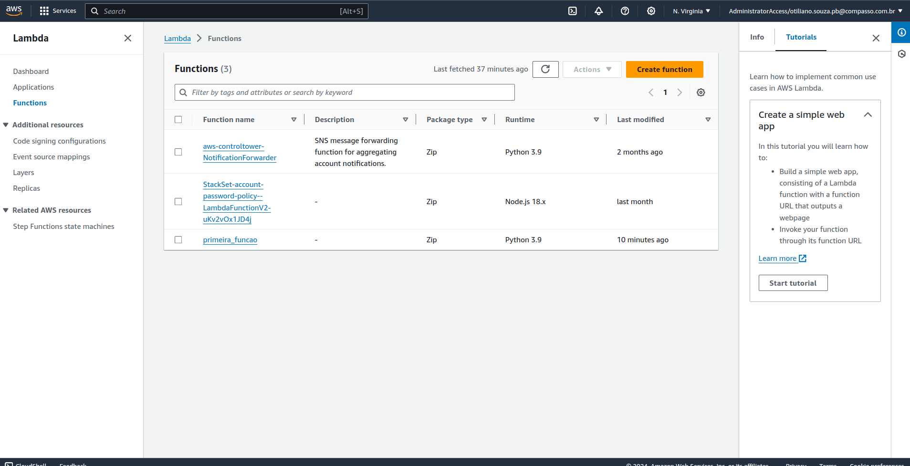
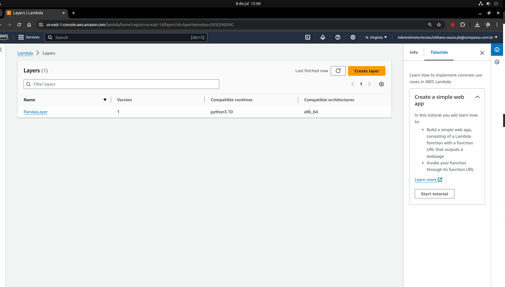
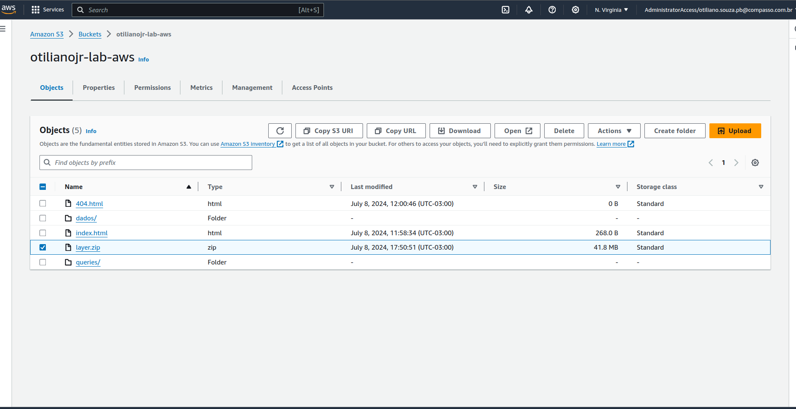
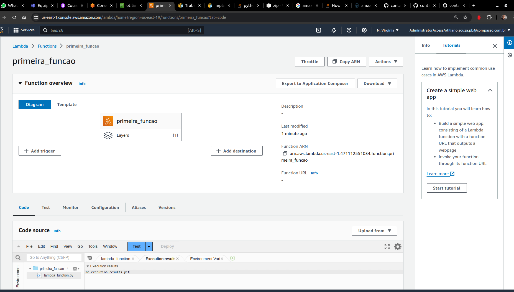
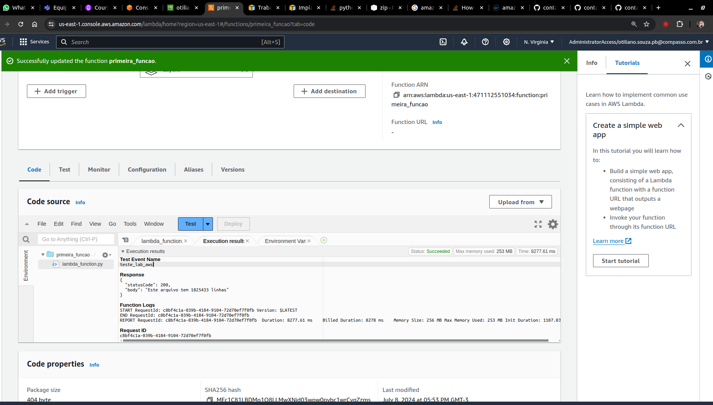

# Lab AWS Lambda

## Pré-requisitos
- Leia sobre [como criar sua primeira função Lambda](https://docs.aws.amazon.com/pt_br/lambda/latest/dg/getting-started.html#getting-started-create-function).
- Conclua os laboratórios [Lab AWS S3](../lab-aws-s3) e [Lab AWS Athena](../lab-aws-athena).
- Tenha o software Docker instalado na máquina.

## 1. Criar a Função Lambda (primeira_funcao)
- Configuramos com Python 3.9 pois o 3.7 não é mais aceito pelo Lambda.
- Imagem: 

## 2. Construção do Código

```python
import json
import pandas
import boto3
 
def lambda_handler(event, context):
    s3_client = boto3.client('s3')
 
    bucket_name = 'otilianojr-lab-aws'
    s3_file_name = 'dados/nomes.csv'
    objeto = s3_client.get_object(Bucket=bucket_name, Key=s3_file_name)
    df = pandas.read_csv(objeto['Body'], sep=',')
    rows = len(df.axes[0])
 
    return {
        'statusCode': 200,
        'body': f"Este arquivo tem {rows} linhas"
    }
```

## 3. Criar um Layer (PandasLayer)
- Uma camada é um arquivo compactado (zip) que pode conter código ou dados adicionais.
- A partir da execução de um Dockerfile Python, compactaremos as dependências para criar a camada.
- Alteramos a imagem utilizada para criar o Docker assim como a estrutura do Dockerfile.
- [Dockerfile](Dockerfile)
- O comando do Dockerfile já gera o zip, então só precisamos copiá-lo para um local fora da imagem para ter acesso.
- Para isso, utilizamos o seguinte código:

```sh
docker build -t lambda-layer .
docker run --rm -v $(pwd):/host lambda-layer cp /lambda/layer.zip /host/
```

- Imagem: 

## 4. Upload do Zip em Bucket(layer.zip)
- Imagem: 

## 5. Lambda com Layer configurado
- Imagem: 

## 6. Execução do Lambda com Sucesso
- Imagem: 
