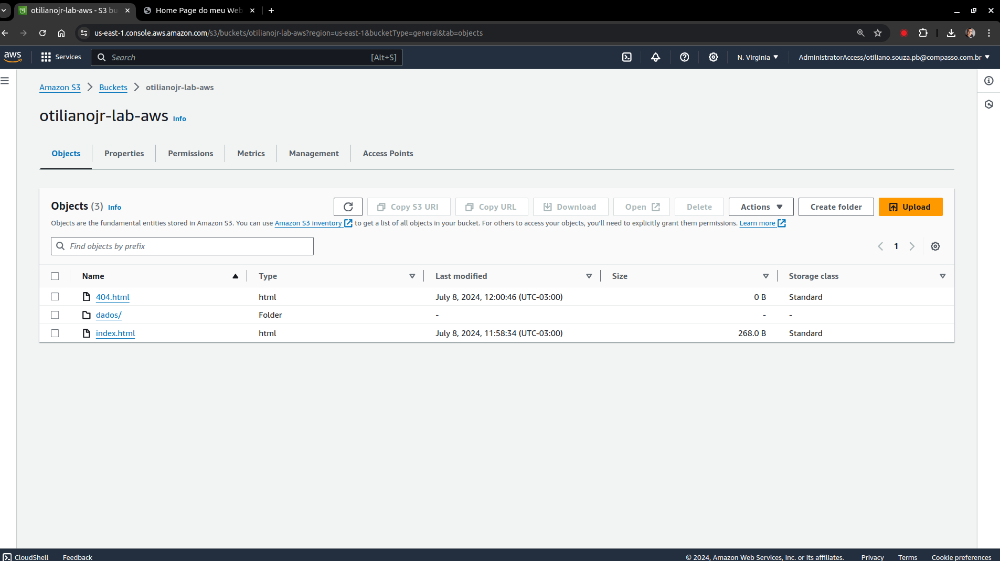
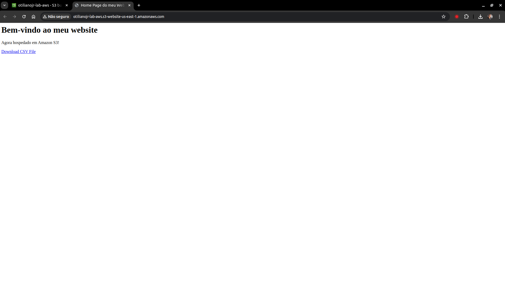
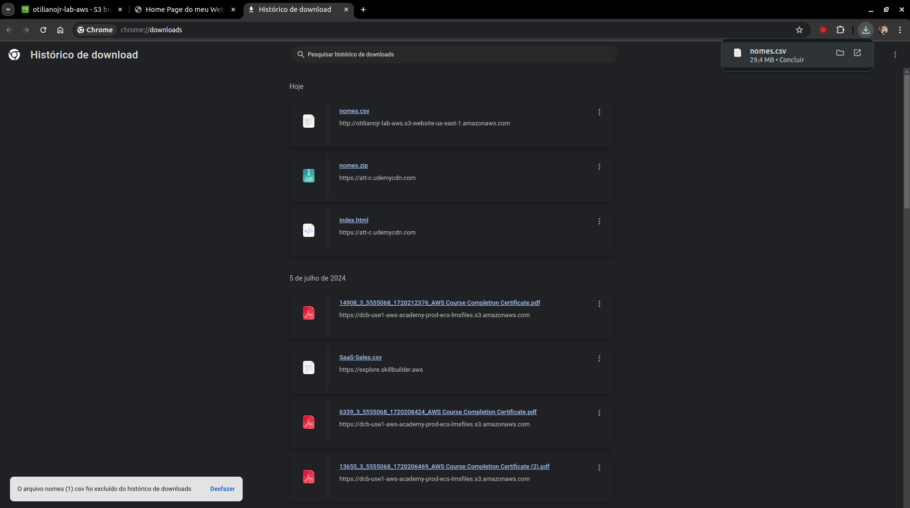

# Lab AWS S3

## 1. Criar um Bucket S3
- Estrutura:
  - `index.html`
  - `404.html`
  - `dados/nomes.csv`

- Imagem:
  

## 2. Configurar o Bucket para Site Estático
- Configuração no `index.html`

- Imagem:
  
  
## 3. Download dos Arquivos a Partir do Site Estático
- Imagem:
  