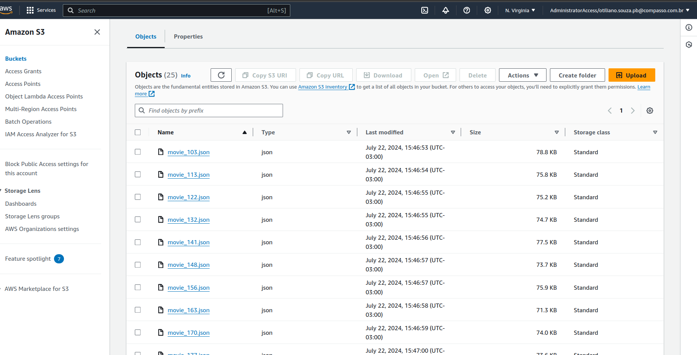

# Desafio Etapa 1

Nesta etapa do desafio, iremos capturar dados do TMDB via AWS Lambda realizando chamadas de API. Os dados coletados devem ser persistidos no Amazon S3, mantendo o formato original (JSON) e, se possível, agrupando em arquivos com no máximo 100 registros cada.

O objetivo é complementar os dados dos Filmes e Séries, carregados na ETAPA 1, com dados oriundos do TMDB (API).

## 1. Criar a Função Lambda (loadDataTMDB)
- Imagem: 

## 2. Construção do Código
- O código da função pode ser acessado neste arquivo: [load_data_tmdb](../desafio/etapa-1/load_data_TMDB.py)

## 3. Criar um Layer (layer-load-tmdb)
- Criamos um layer com as bibliotecas necessárias para a execução da função.
- As bibliotecas podem ser vistas aqui: [requirements.txt](../desafio/etapa-1/requirements.txt)
- A partir da execução de um Dockerfile Python, compactaremos as dependências para criar a camada.
- O arquivo Dockerfile pode ser encontrado aqui: [Dockerfile](../desafio/etapa-1/Dockerfile)
- O comando do Dockerfile já gera o zip, então só precisamos copiá-lo para um local fora da imagem para ter acesso.
- Para isso, utilizamos o seguinte código:

```sh
docker build -t load_data_image .
docker run --rm -v $(pwd):/host load_data_image cp /lambda/layer-load-tmdb.zip /host/
```

- Imagem: 

- Vale lembrar que estou em um ambiente de execução Linux, logo os comandos podem ser diferentes para outro SO.

## 4. Acesso do Lambda ao Bucket (ROLE)
- Imagem: 

## 5. Upload do Zip em Bucket (layer-load-tmdb.zip)
- Como o zip possui mais de 10MB, é recomendado subir em um bucket S3.
- Imagem: 
- Criamos uma pasta `layer` para colocar os arquivos zip-layer do projeto.
- Imagem: 

## 6. Layer Configurado
- Imagem: 

## 7. Lambda com Layer Configurado (loadDataTMDB)
- Imagem: 

## 8. Amazon EventBridge Schedules (trigger-lambda-tmdb)
- Imagem: 
- O agendamento foi feito para executar uma vez às 13:41 do dia 24 de julho de 2024

## 9. Execução da Função (loadDataTMDB)
- Imagem: 

## 10. Arquivos Upados (data-lake-otiliano)
- Imagem: 
- Imagem: 

