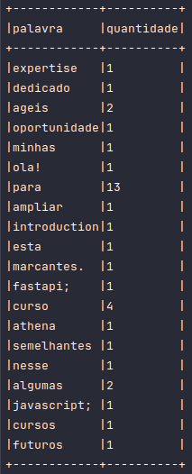

# Exercício - Contador de Palavras

Neste exercício, criei um [Dockerfile](../contador-palavras/Dockerfile) para configurar um ambiente que utiliza um volume para enviar e analisar dados.

### 1. Montando a Imagem do Dockerfile

```bash
docker build -t jupyter-spark .
```

### 2. Copiando o Arquivo para o Volume e Executando o Container

Substitua o caminho `/home/oti-dev/Documentos/estagio_compass_uol` pelo local onde está o seu arquivo:

```bash
docker run -d -p 8888:8888 -v /home/oti-dev/Documentos/estagio_compass_uol:/app/data --name jupyter-spark-container jupyter-spark
```

### 3. Verificando o Log para Encontrar a URL

Se você quiser acessar o Jupyter no navegador, verifique o log do container para encontrar a URL:

```bash
docker logs jupyter-spark-container
```

### 4. Passo a Passo de Execução

### Execução Interativa do Container

Para executar comandos dentro do container, use:

```bash
docker exec -it jupyter-spark-container /bin/bash
```

### Iniciando o PySpark

Dentro do container, inicie o PySpark com:

```bash
pyspark
```

---

## Contador de Palavras

Para executar a contagem de palavras, siga os passos abaixo:

### Importação das Dependências

```python
from pyspark.sql import SparkSession
from pyspark.sql.functions import explode, split, col, lower, udf
from unidecode import unidecode
from pyspark.sql.types import StringType
```

### Criação da SparkSession

```python
spark = SparkSession.builder.appName("conta-palavras").getOrCreate()
```

### Definindo o Caminho do Arquivo no Volume Montado

```python
file_path = "/app/data/README.md"
```

### Leitura do Arquivo como um DataFrame

```python
df = spark.read.text(file_path)
```

### Definição da UDF para Remover Acentos

```python
def unidecode_udf(s):
    return unidecode(s)

unidecode_udf = udf(unidecode_udf, StringType())
```

### Processamento dos Dados

```python
palavras_df = df.select(explode(split(col("value"), "\s+")).alias("palavra"))
palavras_df = palavras_df.withColumn("palavra", lower(unidecode_udf(col("palavra"))))
```

### Contagem da Frequência de Cada Palavra

```python
contador_palavras = palavras_df.groupBy("palavra").count().withColumnRenamed("count", "quantidade")
```

### Exibindo os Resultados

```python
contador_palavras.show(truncate=False)
```


---