# Laboratório de AWS Glue

## 1. Upload de Dados

Upload do arquivo `nomes.csv`:

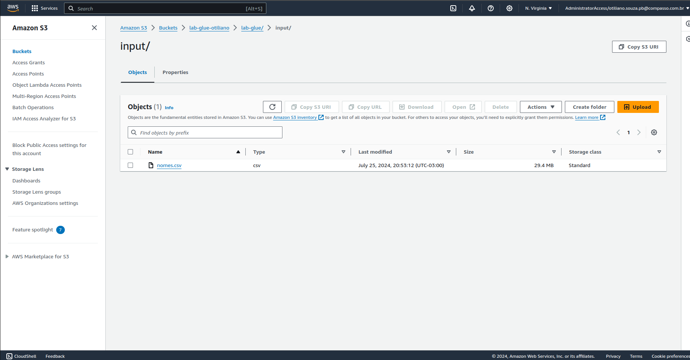

## 2. Configuração do AWS Glue

### Grupos de Permissão

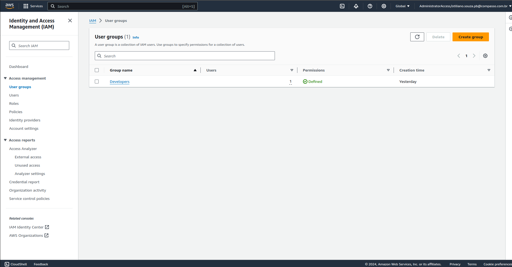

### Permissões do Grupo Developers

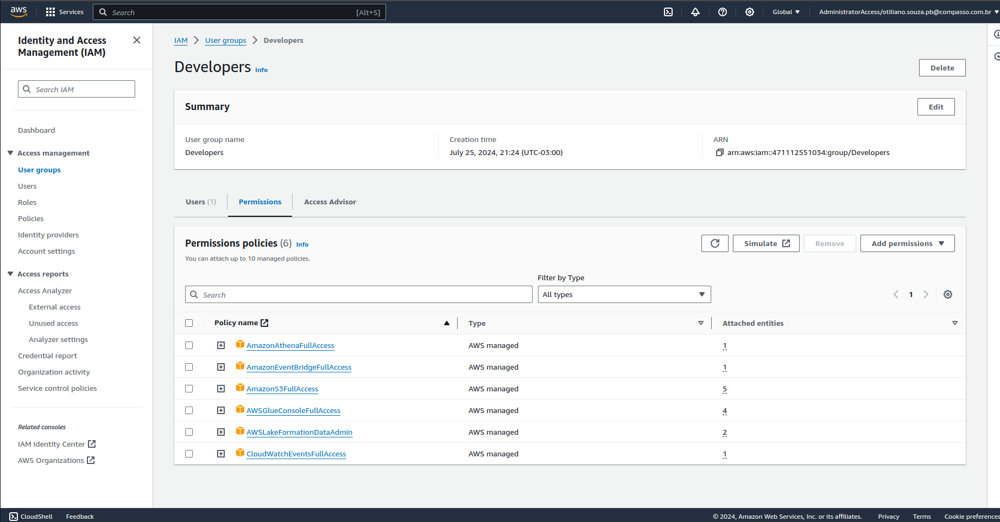

### Permissões do AWS Glue

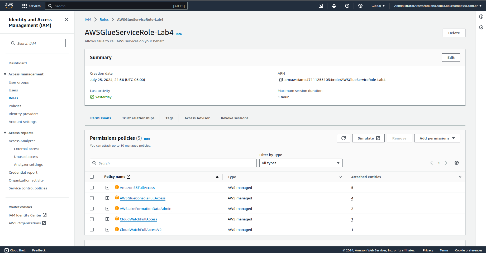

## 3. Job no AWS Glue

O arquivo com o código utilizado pode ser encontrado [aqui](job_aws_glue_lab_4.py).

## Exercícios

### Impressão do Schema

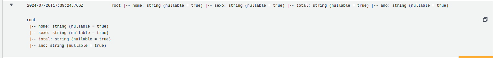

### Impressão da Contagem de Linhas

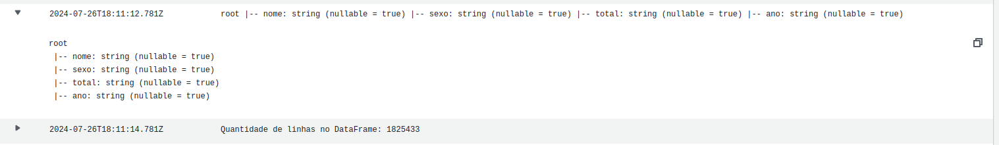

### Impressão da Contagem de Nomes

Contagem de nomes agrupados pelos campos ano e sexo:

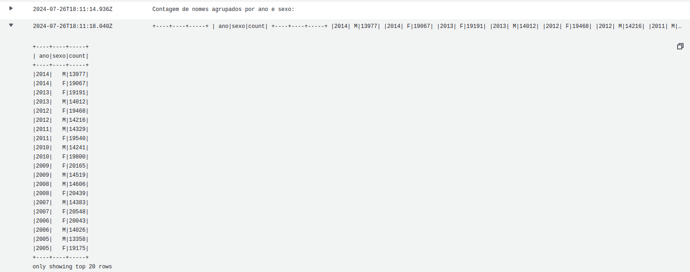

### Nome Feminino com Mais Registros e Nome Masculino com Mais Registros

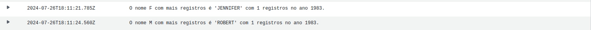

### Total de Registros (Masculinos e Femininos) - 10 Linhas

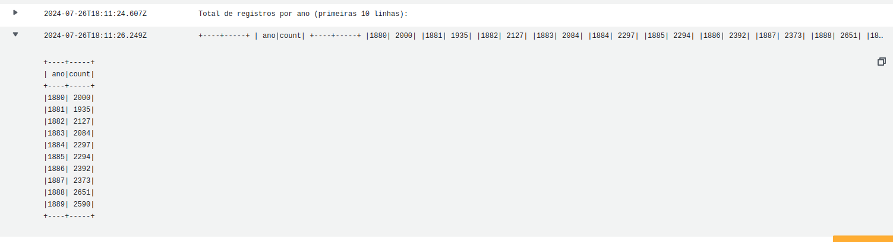

### DataFrame com Valores de Nome em Maiúsculo no S3

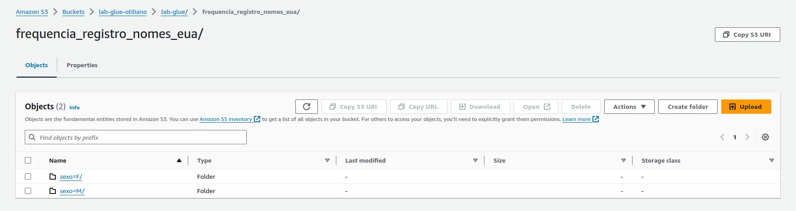

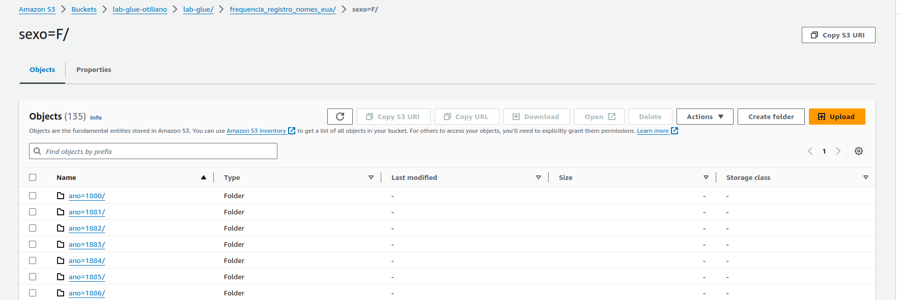

### Crawler

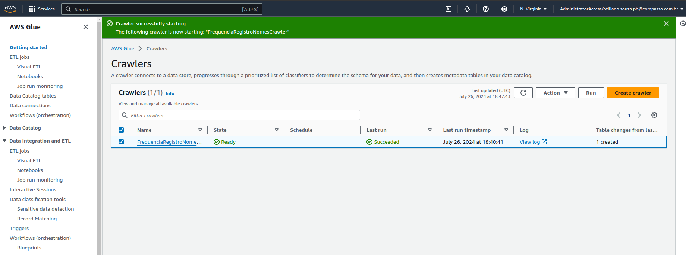

### Athena

Consulta no Athena para mostrar que o banco criado pelo Crawler está funcionando:

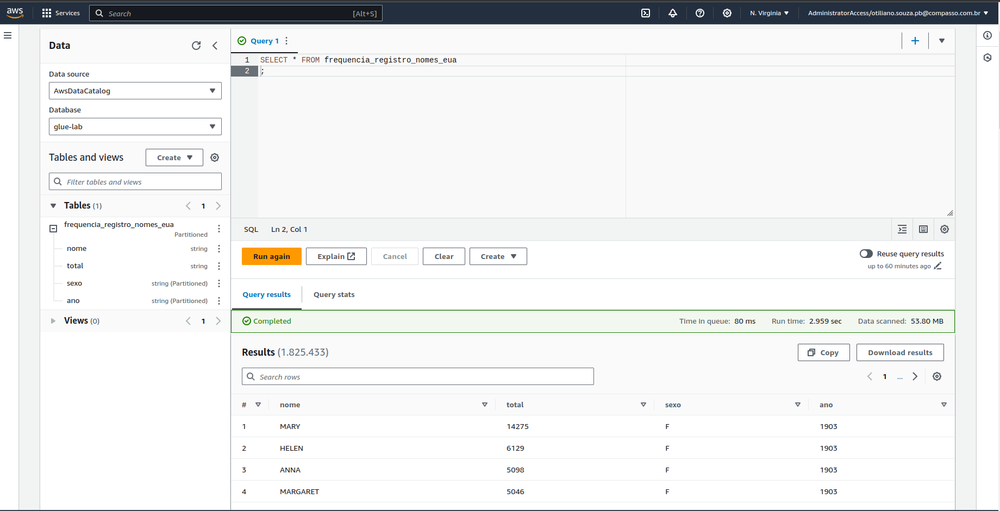