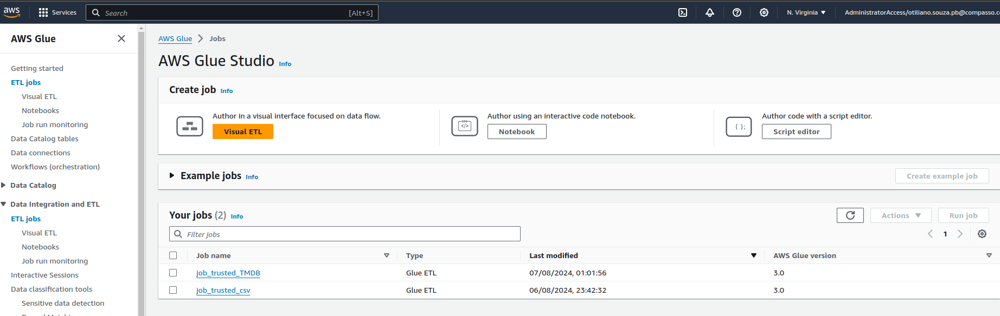
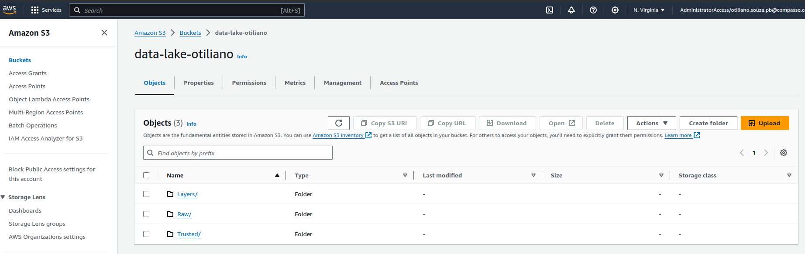
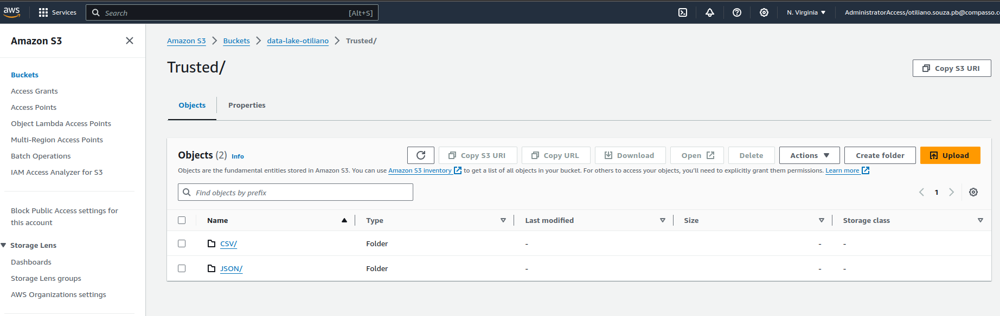
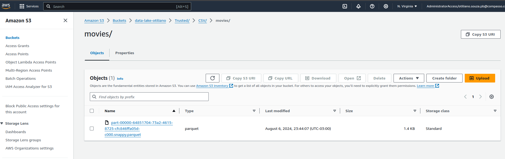
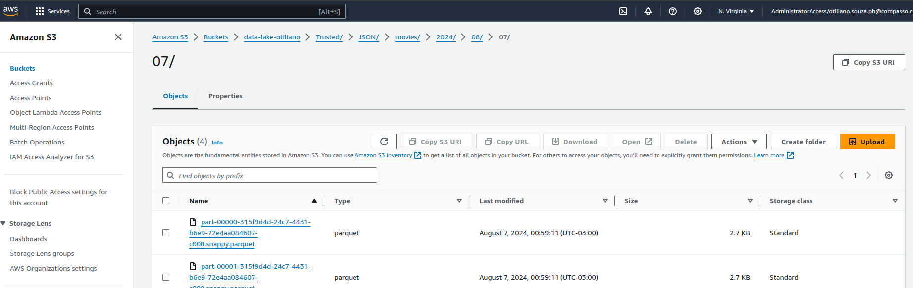
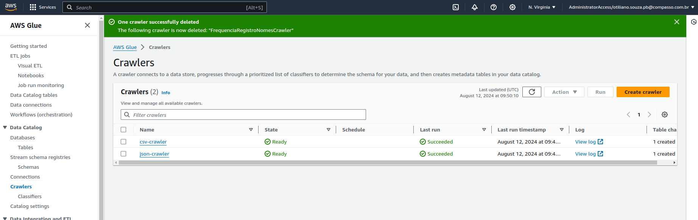
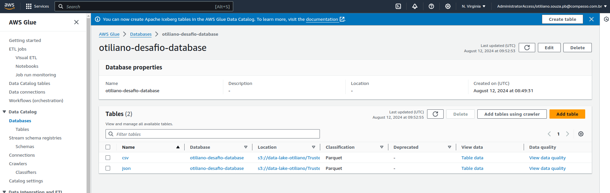
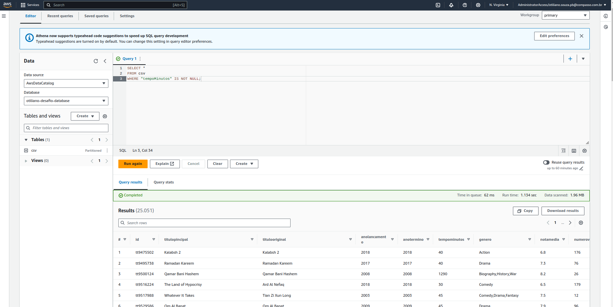
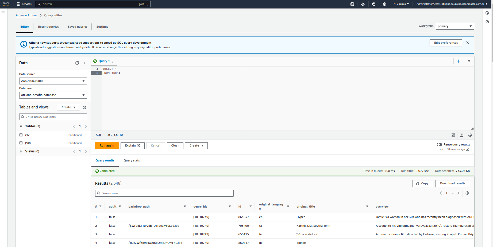

# Desafio

Neste desafio, vamos realizar o processamento da camada "trusted" do data lake, que é o resultado da integração das diversas fontes de origem encontradas na camada "raw".

## 1. Processamento (AWS Glue)

Nesta etapa, utilizamos Apache Spark e AWS Glue para executar dois jobs de tratamento de dados: um para processar dados em [CSV](job-csv.py) e outro para [JSON](job-json.py). Os códigos podem ser acessados nos respectivos links. A imagem abaixo mostra os jobs no Glue. Os arquivos Python deste projeto estão comentados com o objetivo de cada função para facilitar a compreensão do código.

- Imagem: 

## Data Lake

Aqui está como o Data Lake ficou após a criação da camada `trusted`:

- Imagem: 

Modelo da camada `trusted`:

- Imagem: 

Modelo de arquitetura dos arquivos `CSV` armazenados:

- Imagem: 

Modelo de arquitetura dos arquivos `JSON` armazenados:

- Imagem: 

## Crawler

Nesta etapa, criamos dois crawlers um para carregar os dados do JSON e outro para o CSV.

- Imagem: 

## Glue Catalog

As tabelas criadas no banco de dados `otiliano-desafio-database` pelos crawlers foram `csv` e `json`.

- Imagem: 

## Athena

Consultas no Athena mostram que os bancos criados pelos crawlers estão funcionando corretamente:

- Imagem CSV: 
- Imagem JSON: 

Aqui está o markdown corrigido e aprimorado:

## Atualizações

Após análise dos dados obtidos na API TMDB e no CSV, decidi 
trabalhar exclusivamente com remakes de filmes do gênero **Drama** e alguns filmes de sugestões para remake.
As motivações e justificativas para essa escolha estão detalhadas neste [README](../../README.md). É importante ressaltar 
que agora possuimos uma lista de filme especifica que irá ser utilziada.

Como resultado, a atualização realizada incluiu a exclusão dos dados de séries na construção da camada **trusted**. 
Além disso, foram feitas modificações nos nomes das colunas dos arquivos vindos dos formatos CSV e a adição em ambas fontes de dados da coluna 'origem',
para facilitar a junção de dados e analise do mesmo.

Os códigos atualizados podem ser visualizados aqui:

- [Job CSV](../desafio/job-csv.py)
- [Job JSON](../desafio/job-json.py)

Essas atualizações visam garantir consistência entre os dados e simplificar processos futuros de integração.