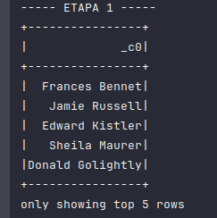
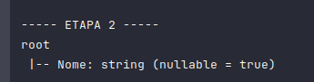
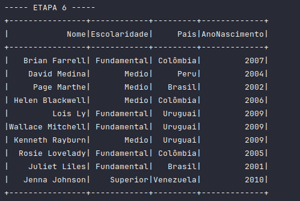
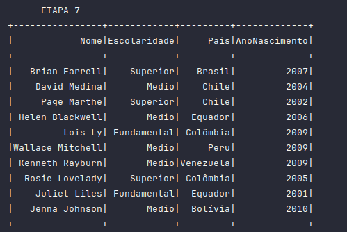
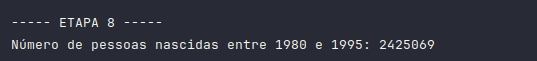
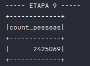
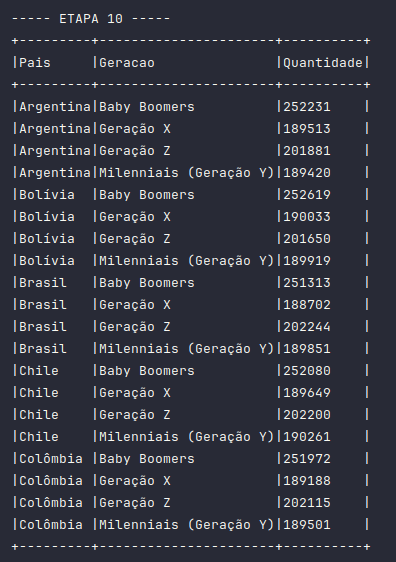

## Objetivos

Aplicar recursos básicos de manipulação de DataFrames utilizando o framework Apache Spark.

## Instruções

Utilizando o arquivo [nomes_aleatorios.txt](../geracao-dados/data/nomes_aleatorios.txt), criaremos um DataFrame e testaremos comandos SQL. O código utilizado pode ser encontrado aqui: [Exercicio](ExercicioIntro.py).

## Etapa 1

Após ler o arquivo e criar um DataFrame, imprimimos algumas linhas para verificar sua execução.

## Etapa 2

Renomear a coluna do DataFrame.

## Etapa 3

Criar uma coluna chamada `escolaridade` e atribuir valores como "fundamental", "médio" ou "superior".

## Etapa 4

Adicionar uma coluna chamada `pais`, contendo um dos 13 países da América do Sul de forma aleatória.

## Etapa 5

Criar uma nova coluna chamada `AnoNascimento` e atribuir anos entre 1945 e 2012. As etapas 3, 4 e 5 podem ser observadas no código.

## Etapa 6

Selecionar as pessoas que nasceram neste século.

## Etapa 7

Utilizar Spark SQL para resolver a questão da Etapa 6.

## Etapa 8

Utilizar a função `select` do DataFrame para contar o número de pessoas da geração Millennial.

## Etapa 9

Utilizar Spark SQL para resolver a questão da Etapa 8.

## Etapa 10

Utilizar Spark SQL para obter a quantidade de pessoas de cada país para cada geração, e em seguida, imprimir todas as linhas em ordem crescente.

