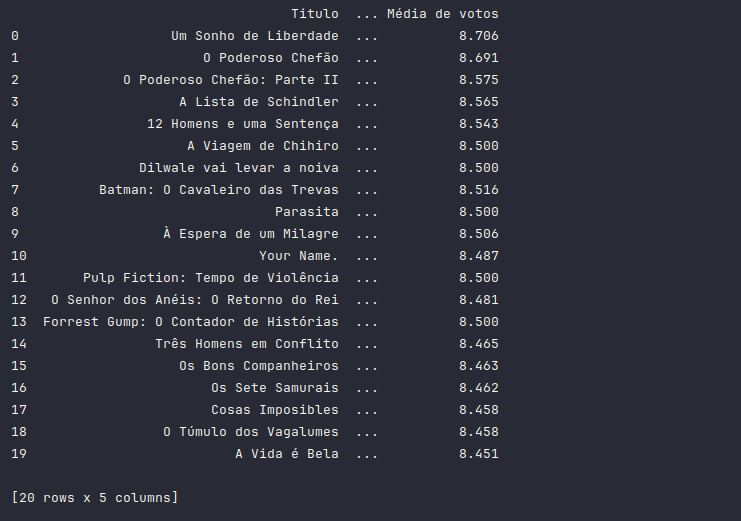

# Preparação do Ambiente

Para resolver os exercícios deste desafio, é necessário preparar o ambiente para usar o Python. Vamos começar criando um ambiente virtual (venv) para o nosso projeto.

1. Primeiro, instale as dependências do `python3-venv`:

   ```bash
   sudo apt install python3-venv
   ```
   
2. Em seguida, crie o ambiente virtual no projeto:

   ```bash
   python3 -m venv venv
   ```
3. O próximo passo é ativar o ambiente virtual:

   ```bash
   source venv/bin/activate
   ```
   
4. Após ativar o ambiente virtual, navegue no terminal até a pasta sprint-8/exercicios/. Nesta pasta, você 
encontrará diretórios para cada exercício e, quando necessário, haverá um arquivo requirements.txt, pois cada
exercício foi desenvolvido separadamente e tem suas próprias dependências. Execute o seguinte comando para 
instalar as dependências:

   ```bash
   pip install -r requirements.txt
   ```

## Objetivos

Criar um processo de extração de dados da API TMDB utilizando AWS.

## Configuração

Para que o código seja executado com sucesso, é necessário possuir uma chave de acesso válida para a API TMDB. Após obter a chave de acesso, você deve configurá-la em um arquivo `.env`. Um arquivo de exemplo está disponível aqui: [env-example](.env-example). 

Além disso, todas as bibliotecas necessárias para a execução estão listadas no arquivo [requirements.txt](requirements.txt).

### Exercício

O arquivo [tmdb_top_movies](tmdb_top_movies.py) é responsável pela conexão com a API TMDB, bem como pelo tratamento dos dados para retornar os filmes melhor avaliados.


