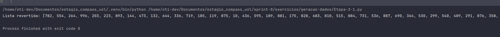
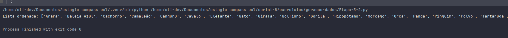
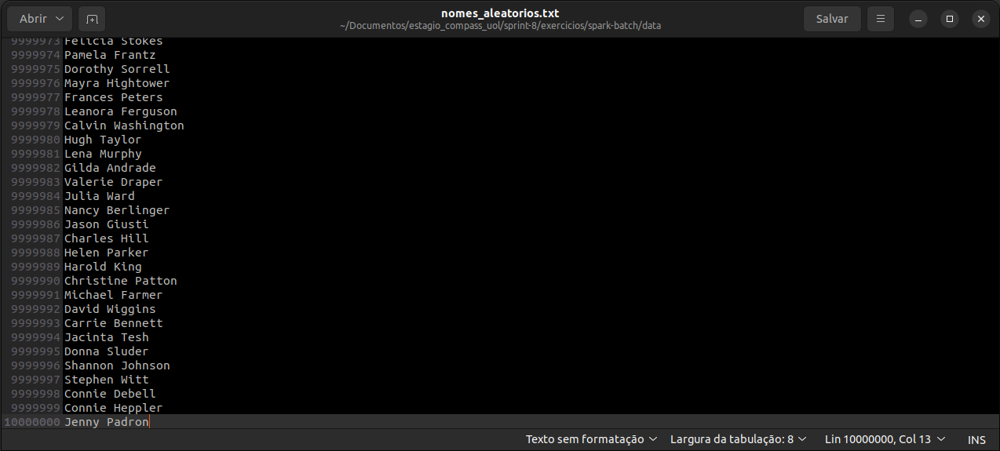

# Preparação do Ambiente

Para resolver os exercícios deste desafio, é necessário preparar o ambiente para usar o Python. Vamos começar criando um ambiente virtual (venv) para o nosso projeto.

1. Primeiro, instale as dependências do `python3-venv`:

   ```bash
   sudo apt install python3-venv
   ```
   
2. Em seguida, crie o ambiente virtual no projeto:

   ```bash
   python3 -m venv venv
   ```
3. O próximo passo é ativar o ambiente virtual:

   ```bash
   source venv/bin/activate
   ```
   
4. Após ativar o ambiente virtual, navegue no terminal até a pasta sprint-8/exercicios/. Nesta pasta, você 
encontrará diretórios para cada exercício e, quando necessário, haverá um arquivo requirements.txt, pois cada
exercício foi desenvolvido separadamente e tem suas próprias dependências. Execute o seguinte comando para 
instalar as dependências:

   ```bash
   pip install -r requirements.txt
   ```

## Objetivos
Geração de dados para as próximas atividades.

## Etapa 1

Para completar a primeira etapa do exercício, execute o arquivo [Etapa-1](Etapa-3-1.py). Este código gera uma lista de 250 inteiros aleatórios, aplica o método `reverse` e imprime o resultado.



## Etapa 2

Nesta etapa, uma lista contendo os nomes de 20 animais foi criada e ordenada em ordem crescente. O resultado foi salvo em um arquivo CSV. O código pode ser encontrado em [Etapa-2](Etapa-3-2.py) e o arquivo CSV gerado está na pasta `data` sob o nome [lista_animais_ordenada](data/lista_animais_ordenada.csv).



## Etapa 3

Nesta etapa, um código em Python foi elaborado para gerar um dataset de nomes de pessoas. O código pode ser encontrado em [Etapa-3](Etapa-3-3.py) e o arquivo TXT gerado está na pasta `data` sob o nome [nomes_aleatorios](data/nomes_aleatorios.txt). A imagem abaixo mostra o arquivo aberto no editor de texto.

