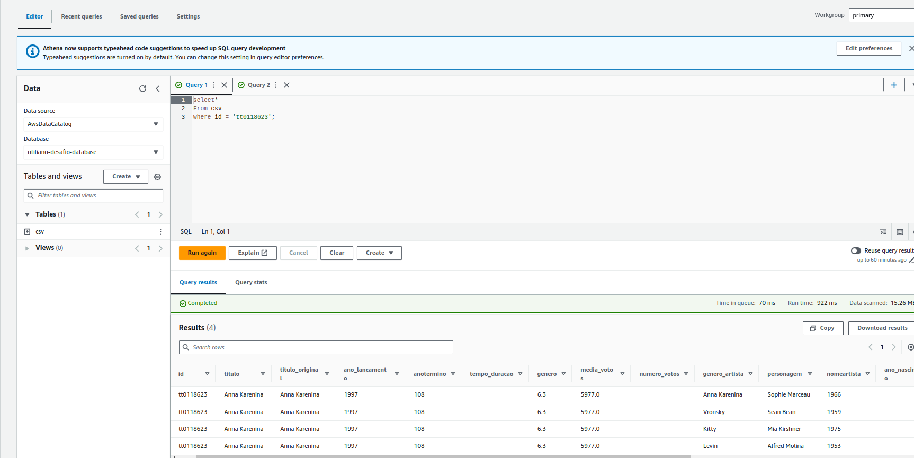
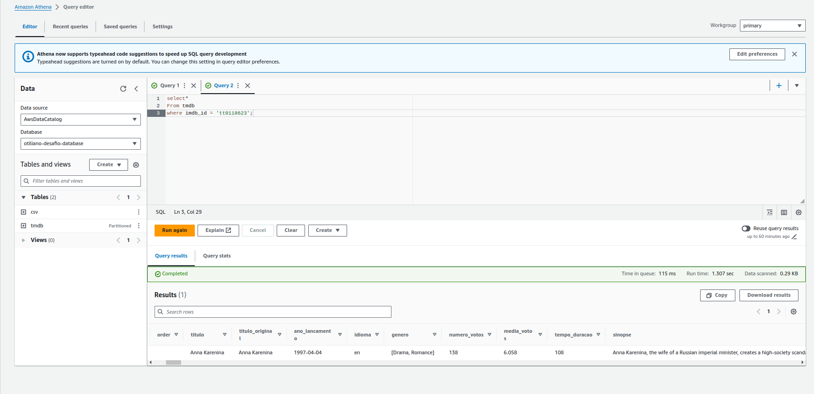
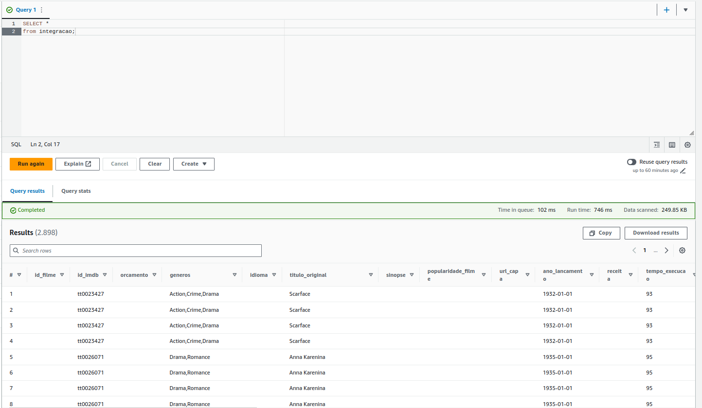
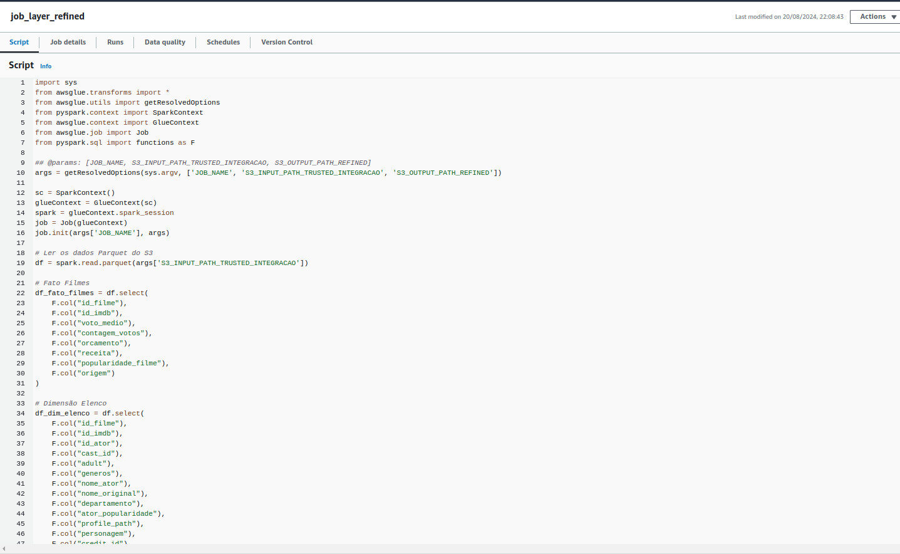
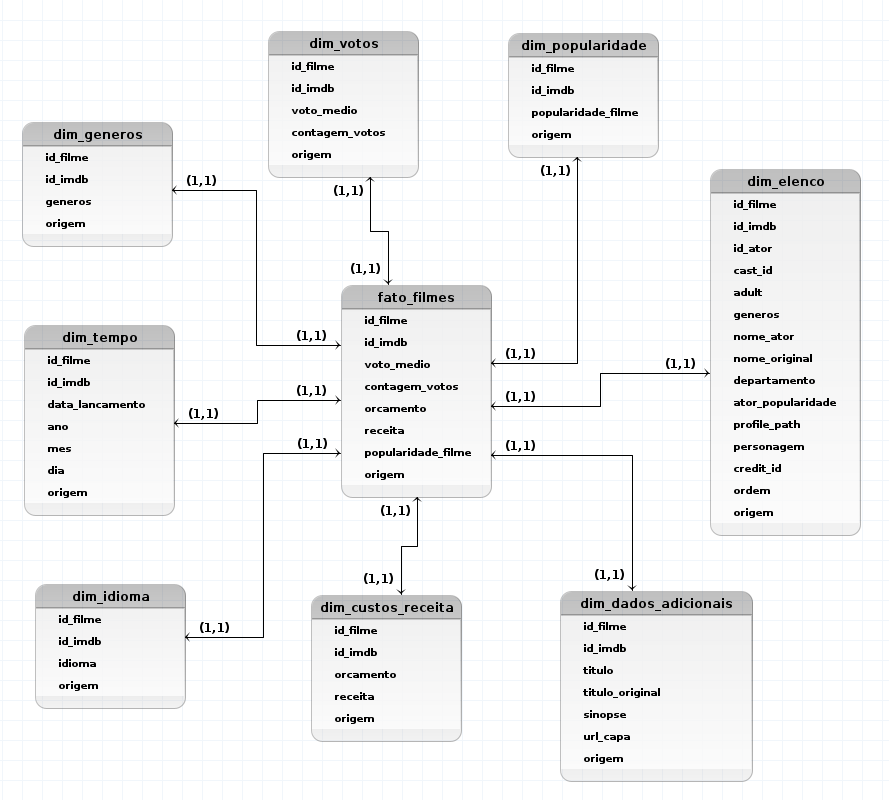
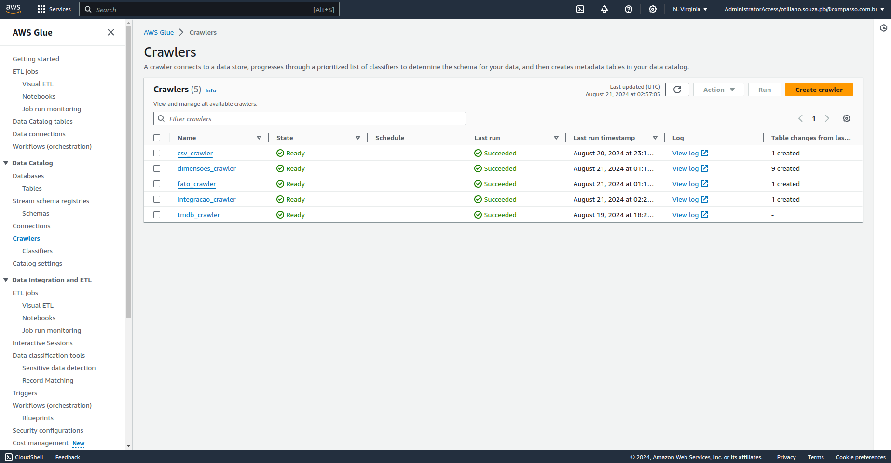
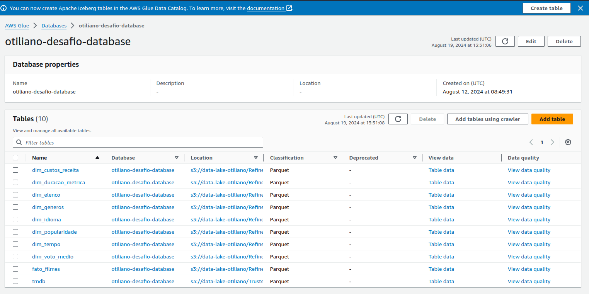
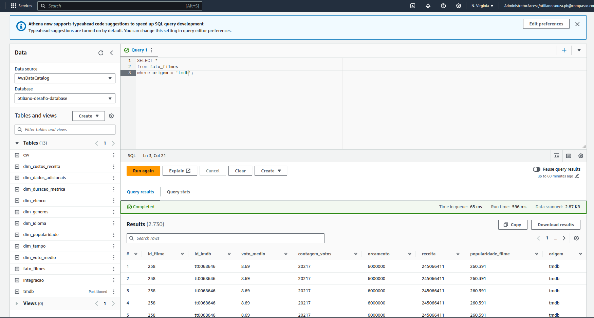

# Desafio

Neste desafio, vamos realizar o processamento da camada "refined" do data lake, que é o resultado da limpeza dos 
dados obtidos até o momento, vindos da camada trusted.

## 1. Processamento (AWS Glue)

Nesta etapa, após verificar os dados vindos da Api TMDB e obtidos pelo arquivo CSV, verifiquei que os dados do TMDB estavam 
mais organizados e completos, aqui está um exemplo de consulta simples em ambos para exemplificar, por isso adicionei um filtro de origem
em todas as tabelas de dimensões, para consegui visualizar a origem do dado.

- Imagem: 

- Imagem: 

Utilizando Apache Spark e AWS Glue executei um job de integração de dados unindo os dados
provinientes do csv e tmdb: [Job Integracão](../desafio/job_integracao.py).

Ele foi responsável pela a união dos dados em uma unica tabela na camada trusted.

A imagem abaixo mostra a tabela que foi gerada dessa união.

- Imagem: 

Utilizando Apache Spark e AWS Glue para executei um job de tratamento de dados, para criar a camada refined [Job Layer Refined](../desafio/job_layer_refined.py).
A imagem abaixo mostra os jobs no Glue.

- Imagem: 

## Banco de dados Dimensional

Ao construir a camada refined além do tratamento do dados já foi feita seu multidimensionamento, pensando na resolução do desafio
dessa forma podemos ver como ficou nosso banco de dados.

- Imagem: 

## Crawler

Nesta etapa, criamos crawlers para carregar os dados do da camada refined direto para o banco de dados.

- Imagem: 

## Glue Catalog

As tabelas criadas no banco de dados `otiliano-desafio-database` podem ser vistas na imagem a seguir.

- Imagem: 

## Athena

Consultas simples no Athena para mostrar que as tabelas estão funcionando depois que dimensionadas.

- Imagem Fato Filmes: 
